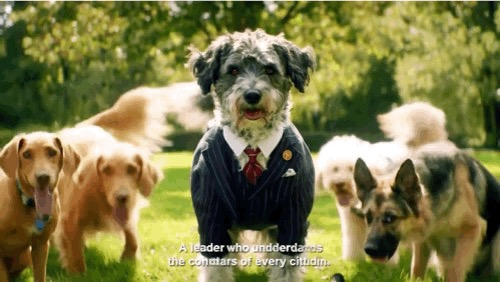

# Obelisk Recontextualization Agent




This agent recontextualizes product images into new scenes based on a user's prompt. It can take a product image from a Google Cloud Storage (GCS) URI or a local file artifact, and then generate a new image with the product in a different setting.

## Features

- **Recontextualize Product Images:**  The core functionality of this agent is to take a product image and place it into a new scene described by a prompt.
- **GCS and Local Image Support:** The agent can accept product images from either a GCS URI or a local file upload (artifact).
- **Person Image Support:** The agent can optionally take a person's image and include it in the generated scene.
- **Multiple Image Generation:** The agent can generate multiple images in a single request.

Setup:

```
gsutil cp -r img/*.png $BUCKET/products/
```

## How it Works

The agent uses the `imagen-product-recontext-preview-06-30` model on Google Cloud's AI Platform to perform the image generation. It has two main tools:

- `generate_recontextualized_images_from_gcs`: This tool is used when the product image is provided as a GCS URI.
- `generate_recontextualized_images_from_artifact`: This tool is used when the product image is provided as a local file artifact.

The agent will automatically select the appropriate tool based on the user's input. After generating the images, they are saved as artifacts and uploaded to a GCS bucket.

## Prerequisites

- **Google Cloud Project:** You need a Google Cloud project with the AI Platform API enabled.
- **Authentication:** You need to be authenticated with Google Cloud.
- **Environment Variables:** The following environment variables need to be set:
    - `GOOGLE_CLOUD_PROJECT`: Your Google Cloud project ID.
    - `GOOGLE_CLOUD_LOCATION`: The Google Cloud region to use (e.g., `us-central1`).
    - `BUCKET`: The GCS bucket to upload the generated images to.

## Example Prompts

#### Important
Make sure images are less than 30 mb

#### Without a person
`use gs://prism-research-25/products/cup.png and put it on top of mt. everest. the product caption is: orange stanley cup 32 oz with straw`

#### With a person
`Generate a picture of me in a desert running with these shoes: gs://prism-research-25/products/shoe.png. These are black running shoes. The picture of me is here: gs://prism-research-25/products/a_guy.png`


# Deployment to Agentspace


Make sure to add the Vertex AI Admin and Service Agent roles to the Service Agent for Reasoning Engine:
`service-YOURPROJECTNUMBER@gcp-sa-aiplatform-re.iam.gserviceaccount.com`

Also make sure the above service account has access to read/write from the `BUCKET` location


Create an Agent Engine using the `notebooks/deployment_guide.ipynb` notebook

Then note the Agent Engine ID (last numeric portion of the Resource Name). e.g.:

```bash
agent_engine = vertexai.agent_engines.get('projects/679926387543/locations/us-central1/reasoningEngines/1093257605637210112')
```

Update the `agent_config_example.json`, then run:

```bash
./publish_to_agentspace_v2.sh --action create --config agent_config.json
```

Usage: `./publish_to_agentspace_v2.sh [OPTIONS]`

```bash
Options:
  -a, --action <create|update|list|delete>  Action to perform (required)
  -c, --config <file>              JSON configuration file
  -p, --project-id <id>            Google Cloud project ID
  -n, --project-number <number>    Google Cloud project number
  -e, --app-id <id>                Agent Space application ID
  -r, --reasoning-engine <id>      Reasoning Engine ID (required for create/update)
  -d, --display-name <name>        Agent display name (required for create/update)
  -s, --description <desc>         Agent description (required for create)
  -i, --agent-id <id>              Agent ID (required for update/delete)
  -t, --instructions <text>        Agent instructions, use the root agent instructions here (required for create)
  -u, --icon-uri <uri>             Icon URI (optional)
  -l, --location <location>        Location (default: us)
  -h, --help                       Display this help message
```

### Example with config file:
```bash
./publish_to_agentspace_v2.sh --action create --config agent_config.json
./publish_to_agentspace_v2.sh --action update --config agent_config.json
./publish_to_agentspace_v2.sh --action list --config agent_config.json
./publish_to_agentspace_v2.sh --action delete --config agent_config.json
```
### Example with command line args:

Create agent:
```bash
./publish_to_agentspace_v2.sh --action create --project-id my-project --project-number 12345 \
--app-id my-app --reasoning-engine 67890 --display-name 'My Agent' \
--description 'Agent description' --instructions 'Agent instructions here'
```
  Update agent:
```bash
./publish_to_agentspace_v2.sh --action update --project-id my-project --project-number 12345 \
--app-id my-app --reasoning-engine 67890 --display-name 'My Agent' \
--agent-id 123456789 --description 'Updated description'
```
  List agents:
```bash
./publish_to_agentspace_v2.sh --action list --project-id my-project --project-number 12345 \
--app-id my-app
```

  Delete agent:
```bash
./publish_to_agentspace_v2.sh --action delete --project-id my-project --project-number 12345 \
--app-id my-app --agent-id 123456789
```