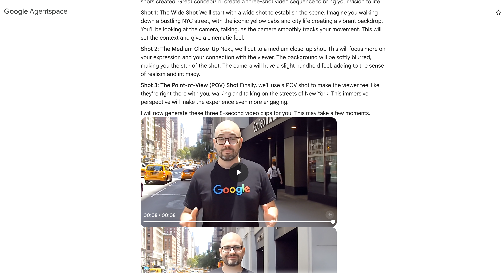

# Obelisk Virtual Try-On and Recontextualization Agent


Obelisk is an AI-powered virtual try-on and image recontextualization system that allows users to:
1. Generate realistic images of people wearing clothing items
2. Recontextualize images using nano-banana (Gemini 2.5 image) to iteratively edit images from text
3. Create animated videos from the final results

The system consists of a backend agent powered by Google's Vertex AI models and a React-based frontend for easy interaction.

## Features

- **Virtual Try-On:** The agent's primary function is to generate a realistic image of a person wearing a clothing item.
- **Iterative Image Editing:** After the virtual try-on, the agent uses nano-banana (Gemini 2.5 image) to iteratively edit the generated image based on text prompts, allowing for sophisticated background changes and other transformations.
- **GCS and Local Image Support:** The agent can accept person and product images from either a GCS URI or a local file upload (artifact).
- **Multiple Image Generation:** The agent can generate multiple images in a single request.

## How it Works

The agent follows a multi-step process:

1.  **Virtual Try-On:** It uses the `virtual-try-on-preview-08-04` model to generate an image of a person wearing a product. This is handled by the `generate_virtual_try_on_images` tool.
2.  **Iterative Image Editing:** It uses nano-banana (Gemini 2.5 image) to iteratively edit images based on text prompts. This powerful model allows for sophisticated image transformations and background changes through natural language instructions.
3.  **Animation with VEO3:** It then uses the `veo-3.0-generate-preview` model to animate the final image. This is handled by the `generate_video` tool.

All generated images are saved as artifacts and uploaded to a GCS bucket.

## Initial Setup

```bash
# Clone the repository
git clone https://github.com/jswortz/obelisk.git
cd obelisk

# Copy sample images to GCS bucket
gsutil cp -r img/*.png $BUCKET/products/
```

## Project Structure

- `/obelisk_recontext_agent/` - Backend agent implementation
- `/frontend/` - React-based web interface
- `/img/` - Sample images and outputs
- `/deployment/` - Deployment configurations
- `/tests/` - Test suites

## Prerequisites

- **Google Cloud Project:** You need a Google Cloud project with the AI Platform API enabled.
- **Authentication:** You need to be authenticated with Google Cloud.
- **Environment Variables:** The following environment variables need to be set:
    - `GOOGLE_CLOUD_PROJECT`: Your Google Cloud project ID.
    - `GOOGLE_CLOUD_LOCATION`: The Google Cloud region to use (e.g., `us-central1`).
    - `BUCKET`: The GCS bucket to upload the generated images to.
- **Python 3.9+** for backend
- **Node.js 18+** for frontend

## Quick Start

### Backend Setup
```bash
# Install dependencies
make install

# Run the backend API
make run
```

### Frontend Setup
```bash
# Install frontend dependencies
make frontend-install

# Run the frontend development server
make frontend-dev
```

The application will be available at `http://localhost:5173`

## Example Usage

#### Important
Make sure images are less than 30 MB

1.  **Upload Images:** Use the web interface to upload a person image and a product image
2.  **Generate Virtual Try-On:** Click "Generate Try-On" to create the initial image
3.  **Edit with Text:** Use natural language prompts to iteratively edit the image:
    - "Place the person on top of Mt. Everest"
    - "Change the background to a sunny beach"
    - "Add a sunset in the background"
    - "Make it look like they're in a fashion show"


# Deployment to Agentspace


Make sure to add the Vertex AI Admin and Service Agent roles to the Service Agent for Reasoning Engine:
`service-YOURPROJECTNUMBER@gcp-sa-aiplatform-re.iam.gserviceaccount.com`

Also make sure the above service account has access to read/write from the `BUCKET` location


Create an Agent Engine using the `deployment_guide.ipynb` notebook

Then note the Agent Engine ID (last numeric portion of the Resource Name). e.g.:

```bash
agent_engine = vertexai.agent_engines.get('projects/679926387543/locations/us-central1/reasoningEngines/1093257605637210112')
```

Update the `agent_config_example.json`, then run:

```bash
./publish_to_agentspace_v2.sh --action create --config agent_config.json
```

Usage: `./publish_to_agentspace_v2.sh [OPTIONS]`

```bash
Options:
  -a, --action <create|update|list|delete>  Action to perform (required)
  -c, --config <file>              JSON configuration file
  -p, --project-id <id>            Google Cloud project ID
  -n, --project-number <number>    Google Cloud project number
  -e, --app-id <id>                Agent Space application ID
  -r, --reasoning-engine <id>      Reasoning Engine ID (required for create/update)
  -d, --display-name <name>        Agent display name (required for create/update)
  -s, --description <desc>         Agent description (required for create)
  -i, --agent-id <id>              Agent ID (required for update/delete)
  -t, --instructions <text>        Agent instructions, use the root agent instructions here (required for create)
  -u, --icon-uri <uri>             Icon URI (optional)
  -l, --location <location>        Agent Space location (default: us)
      --agent-engine-location <location> Agent Engine location (default: us-central1)
  -h, --help                       Display this help message
```

### Example with config file:
```bash
./publish_to_agentspace_v2.sh --action create --config agent_config.json
./publish_to_agentspace_v2.sh --action update --config agent_config.json
./publish_to_agentspace_v2.sh --action list --config agent_config.json
./publish_to_agentspace_v2.sh --action delete --config agent_config.json
```
### Example with command line args:

Create agent:
```bash
./publish_to_agentspace_v2.sh --action create --project-id my-project --project-number 12345 \
--app-id my-app --reasoning-engine 67890 --display-name 'My Agent' \
--description 'Agent description' --instructions 'Agent instructions here'
```
  Update agent:
```bash
./publish_to_agentspace_v2.sh --action update --project-id my-project --project-number 12345 \
--app-id my-app --reasoning-engine 67890 --display-name 'My Agent' \
--agent-id 123456789 --description 'Updated description'
```
  List agents:
```bash
./publish_to_agentspace_v2.sh --action list --project-id my-project --project-number 12345 \
--app-id my-app
```

  Delete agent:
```bash
./publish_to_agentspace_v2.sh --action delete --project-id my-project --project-number 12345 \
--app-id my-app --agent-id 123456789
```
